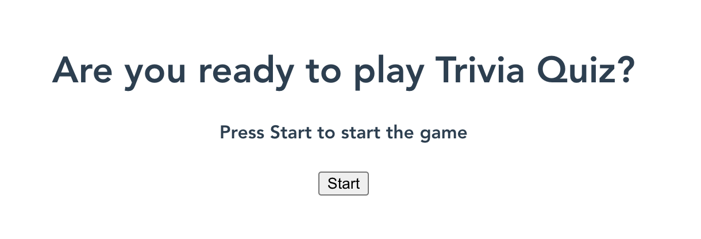
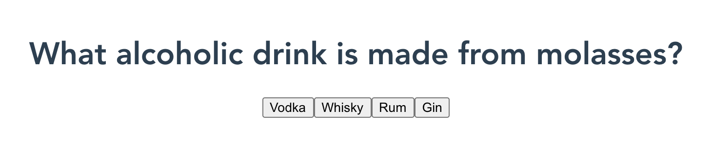
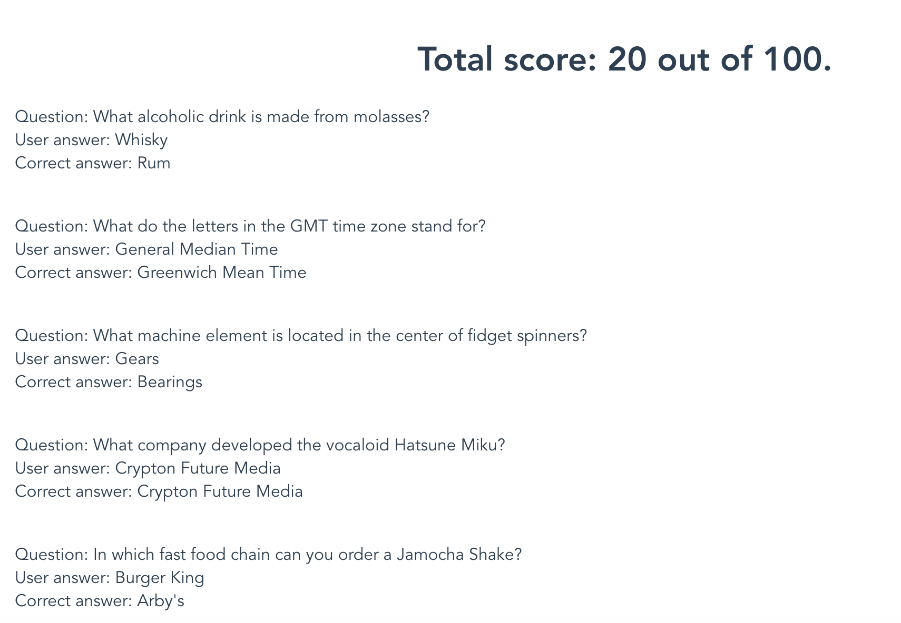

# Trivia game :crystal_ball:

The Trivia Game application is a simple quiz game. The game is written in Vue.js and uses the open Trivia DB API to fetch questions with multiple choice answers.

## Functionality 

### Start screen
The user must click a button to start playing.



### Questions
Once the game started the game fetches 10 questions from the Trivia DB API. It displays each question one-by-one. Once a question answered the user is presented with the next question.



### Result screen
The result screen contains all the questions with the correct answers and the answers the user gave. The total score is displayed on top of the result screen (each question counts for 10 points).



## Created by
Lasse Minet

Hunor Vadasz-Perhat

## Project setup
```
npm install
```

### Compiles and hot-reloads for development
```
npm run serve
```

### Compiles and minifies for production
```
npm run build
```

### Lints and fixes files
```
npm run lint
```

### Customize configuration
See [Configuration Reference](https://cli.vuejs.org/config/).
